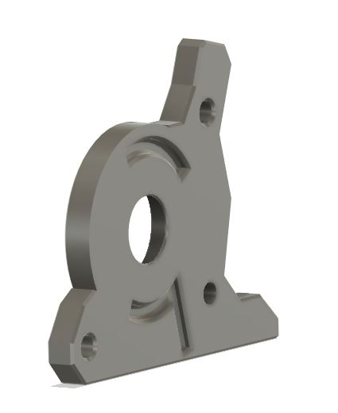
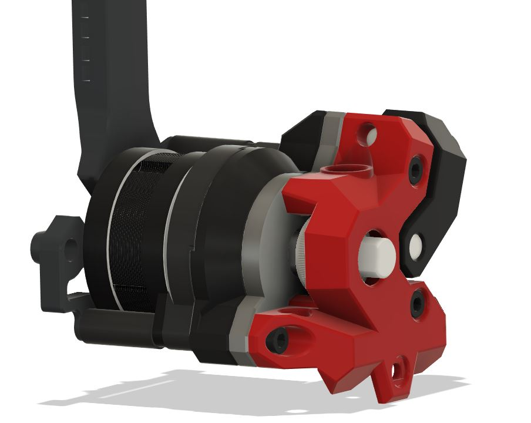
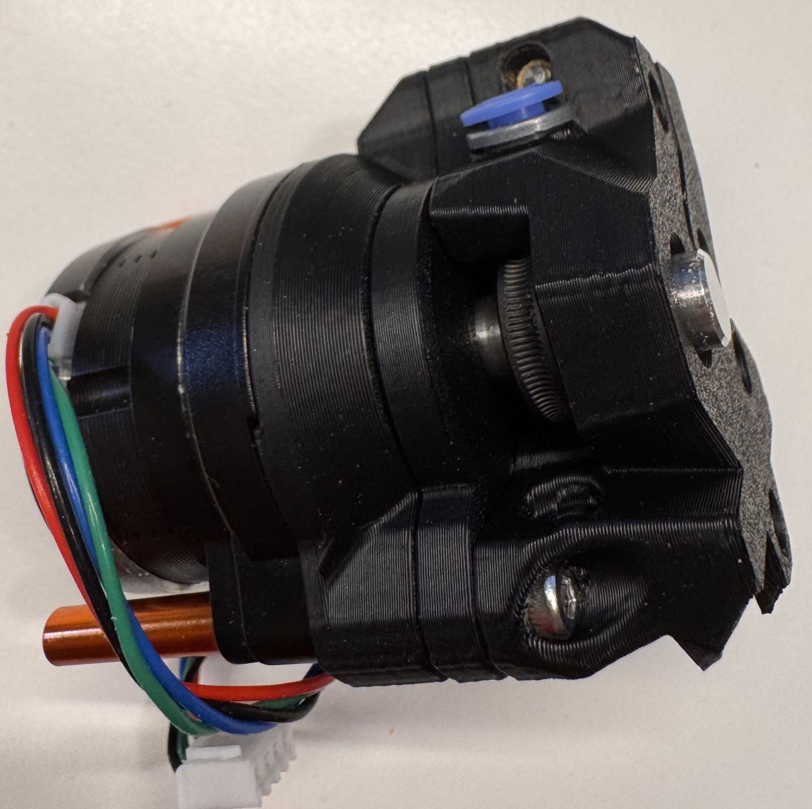
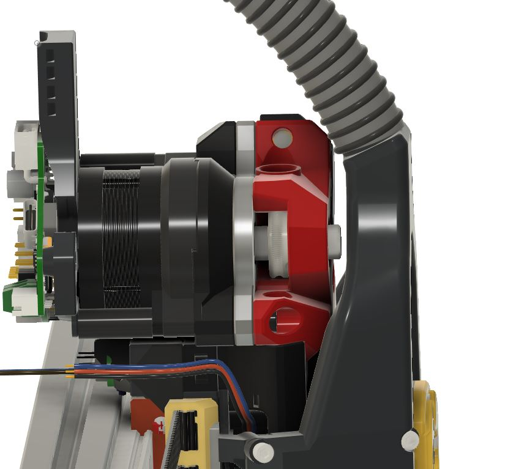

# WWG2-XOL-CPAP
This is a simple plate (sapcer) for [WristWatch-G2-Extruder](https://github.com/tetsu97/WristWatch-G2-Extruder)  to allow instalation on [XOL CPAP toolhead](https://github.com/Armchair-Heavy-Industries/Xol-Toolhead) withowt cutting the extruder shaft. It sits betwwen rear plate and front body and so it's moving back the motor and the gearbox leaving in place everything else.

